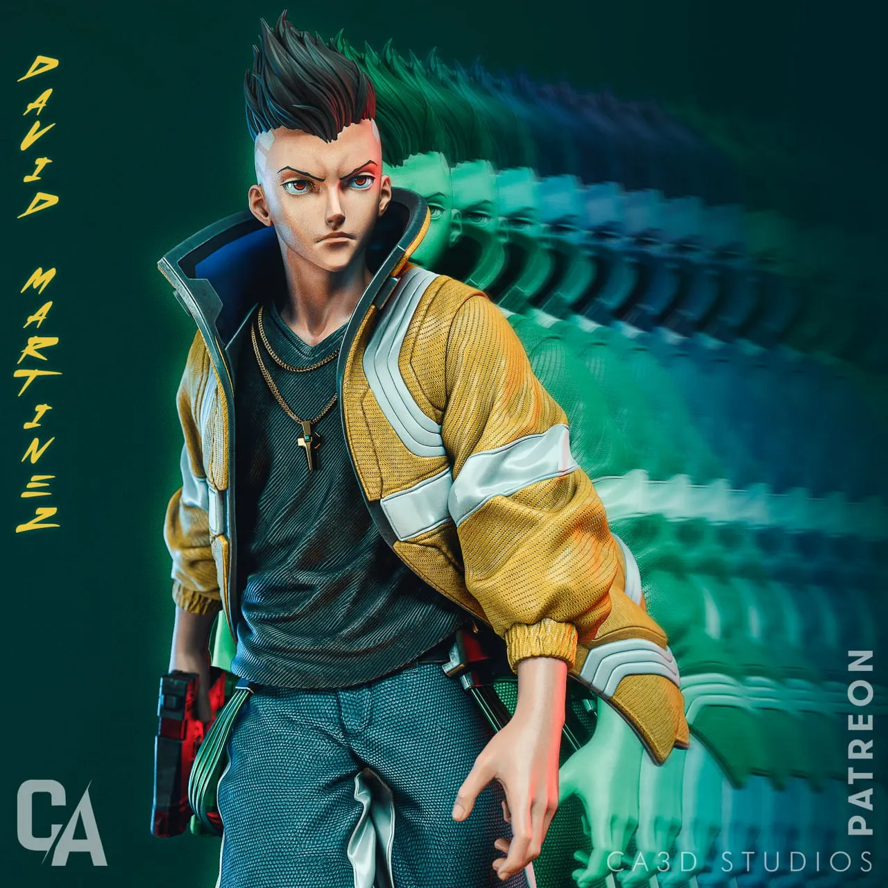
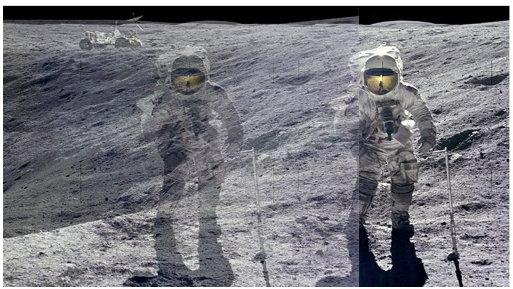

# Quiz8
## Part 1: Imaging Technique Inspiration
The imaging technique I find inspiring is the after-image or motion trail effect seen in the anime Cyberpunk: Edgerunners, specifically used to represent the "Sandevistan" speed ability. I want to incorporate the multi-layered, color-shifted silhouettes that follow the main subject during fast movement. This technique is beneficial because it effectively communicates extreme speed and dynamic energy in a 2D space. It creates a visually striking "temporal echo" that aligns perfectly with the futuristic and high-action requirements of my upcoming project.
### Inspiration Images

## Part 2: Coding Technique Exploration
To implement this effect, I will utilize a combination of Arrays and Class Constructors to manage image objects. Each "after-image" will be an instance of a class, stored in an array that tracks the character's movement history. By applying the Image Transparency (Alpha) technique, I can render these past frames with decreasing opacity levels. This mirrors the "temporal echo" of the Sandevistan ability, allowing multiple silhouettes to fade out smoothly over time.
### Coding Technique Example
**Screenshot of Technique:** 
**Example Implementation:** [p5.js Image Transparency Example](https://p5js.org/examples/imported-media-image-transparency/)
